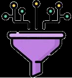
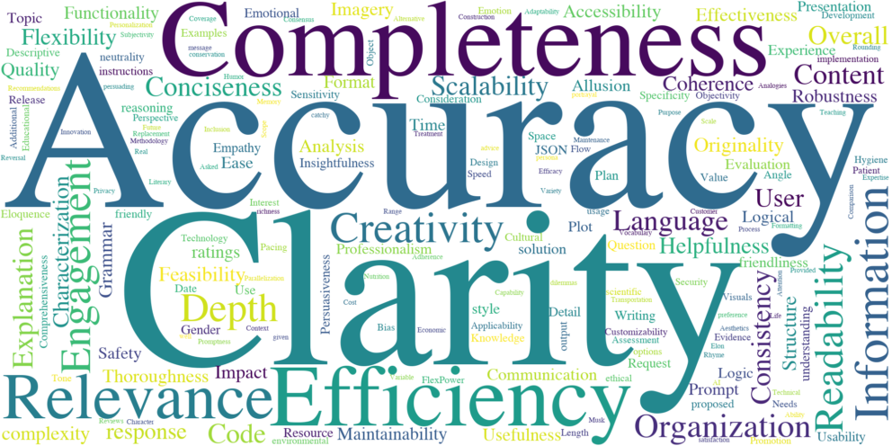
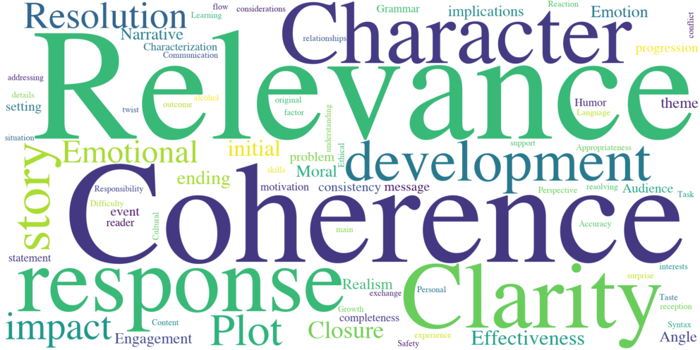
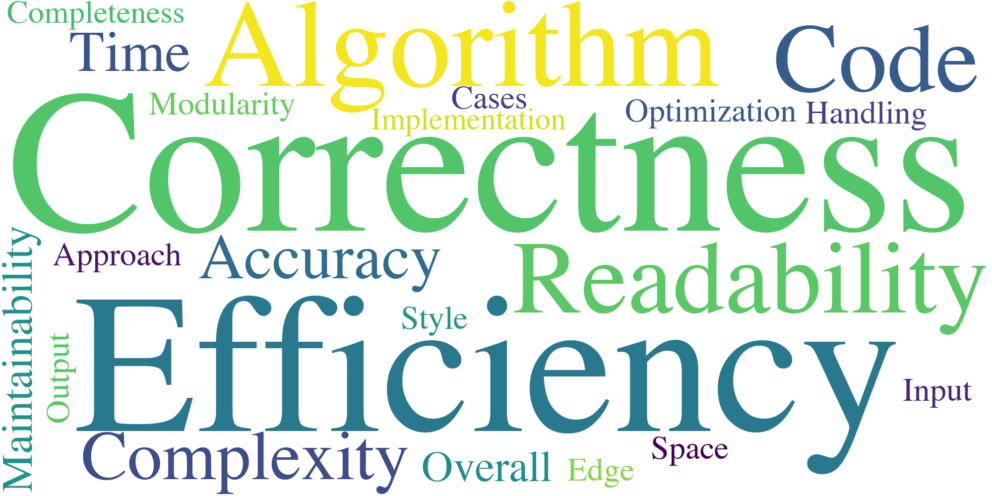

## Page 1
Wider and Deeper LLM Networks
are Fairer LLM Evaluators
Xinghua Zhang1, Bowen Yu2∗, Haiyang Yu2,
Yangyu Lv2, Tingwen Liu1∗, Fei Huang2, Hongbo Xu1, Yongbin Li2
1 Institute of Information Engineering, Chinese Academy of Sciences
2 Alibaba DAMO Academy
{zhangxinghua,liutingwen,hbxu}@iie.ac.cn,
{yubowen.ybw,yifei.yhy,yangyu.lyy,f.huang,shuide.lyb}@alibaba-inc.com
Abstract
Measuring the quality of responses generated by large language models (LLMs) is
a challenging task, particularly when it comes to evaluating whether the response
is aligned with human preference. A novel approach involves using the LLM
itself to make evaluation and stabilizing the results through multiple independent
evaluations, similar to a single-layer narrow LLM network. This network consists
of a fixed number of neurons, with each neuron being the same LLM. In this paper,
we draw upon the extensive research on deep neural networks to explore whether
deeper and wider networks can lead to fairer evaluations. Specifically, inspired
by the observation that different neurons in a neural network are responsible for
detecting different concepts, we first adaptively generate as many neuron roles
as possible for each evaluation sample. Each perspective corresponds to the role
of a specific LLM neuron in the first layer. In subsequent layers, we follow the
idea that higher layers in deep networks are responsible for more comprehensive
features, each layer receives representations from all neurons in the previous
layer, integrating the locally learned evaluation information to obtain a more
comprehensive evaluation result. Interestingly, this network design resembles
the process of academic paper reviewing, where each reviewer independently
rates based on their preferences. Subsequently, through multiple discussions, they
consider other reviewers’ opinions to reach the final acceptance decision. To
validate the effectiveness of our method, we construct the largest and most diverse
English evaluation benchmark LLMEval2 for LLM evaluators, comprising 15
tasks, 8 abilities, and 2,553 samples. Experimental results demonstrate that a
wider network (involving many reviewers) with 2 layers (one round of discussion)
performs the best, improving kappa correlation coefficient from 0.28 to 0.34.
We also leverage WideDeep to aid in the assessment of Chinese LLMs, which
has accelerated the evaluation time by 4.6 times, resulting in a 60% cost saving.
WideDeep achieves a remarkable 93% agreement level among humans2.
1
Introduction
The rapid progress and remarkable achievements of large-scale pre-trained language models (LLMs)
have catalyzed a revolutionary transformation in the realm of natural language processing [23, 31,
36]. These models have showcased substantial improvements across various applications, such as
∗
Correspondence to: Bowen Yu <yubowen.ybw@alibaba-inc.com>, Tingwen Liu <liutingwen@iie.ac.cn>.
2The data and code of this work is available at https://github.com/AlibabaResearch/DAMO-ConvAI/
tree/main/WideDeep
Preprint. Under review.
arXiv:2308.01862v1  [cs.CL]  3 Aug 2023

## Page 2
Instruction: Please give reviews for two 
responses, … scoring each response (1-10) …
Response 1: 7
Response 2: 9
Response 1: 6
Response 2: 7
Response 1: 8
Response 2: 7
Response 2 
better
Instruction: Please give reviews for two 
responses, … scoring each response (1-10) …
…
Response 1 
better
…
…
(a)
(b)
Single-layer 
Narrow Network
Multi-layer 
Wide Network
Coherence
Accuracy
Response 1: 8
Response 2: 6
Response 1: 9
Response 2: 7
Response 1: 8
Response 2: 6
…
…
Response 1: 8
Response 2: 7
Neuron Role
Evaluation 
Result
Figure 1: (a) Prior methods are single-layer LLM networks that combine assessments from a fixed
number of LLM neurons. (b) In contrast, our method delves into the realm of wider and deeper
multi-layer networks, where each neuron provides a distinct neuron role.
dialogue [42], summarization [4], and code generation [6]. The majority of tasks involve open-ended,
inherently subjective, and reference-free responses, rather than selecting from a fixed set of answers.
Consequently, evaluating the correspondence of their generated responses with human intent becomes
a challenge [28]. Traditional automatic metrics such as BLEU [24] and ROUGE [19] have been
shown to have relatively low correlation with human judgments, especially for open-ended generation
tasks [21],while human evaluation is often time-consuming and costly. Thus, there is a growing
demand for automated assessment methods that can consistently align with human judgments while
being more efficient and cost-effective [13, 18, 5].
Recent research has introduced the LLMs-as-evaluator paradigm, utilizing LLMs to compare can-
didate responses with the assumption that LLMs have learned to assign higher probabilities to
high-quality and fluent texts [7, 8, 14, 16, 32]. FairEval [33] finds that the ranking result of candidate
responses can be easily altered by exchanging their order of appearance in prompt context. They
swap the position of two responses for two rounds of scores and ensemble the results of multiple
LLM runs in pursuit of result stability. Similarly, LLM-as-a-judge [43] also observes the position
bias. It swappes the order of two answers and retaines the evaluation score only if the results remain
consistent in both orders. In cases of inconsistency after swapping, it declares a tie. Essentially, they
regard each LLM as an individual neuron and construct single-layer narrow networks, aggregating
evaluation scores from a limited quantity of LLMs. FairEval [33] identifies that the optimal perfor-
mance is achieved when three LLM neurons are employed; an increase in the number of neurons
leads to a decline in effectiveness. Moreover, existing benchmarks for assessing LLMs’ performance
in evaluating text quality lack diverse evaluation capabilities. For instance, the benchmark utilized by
FairEval comprises only 80 samples. Thus, there is an urgent requirement for more comprehensive
datasets that can holistically evaluate LLMs’ ability to assess the quality of generated text.
In this paper, we first delve into the realm of deeper and wider LLM networks for LLM evalu-
ation. Systematic design has led to the development of deeper and wider neural networks, such
as ResNets [11] for depth and ResNeXT [37] for width. These advancements have resulted in
enhanced learning and ultimately improved performance compared to relatively shallow and narrow
networks [17]. Therefore, we aim to increase the number of LLM neurons and layers that collaborate
in the evaluation network, with the goal of creating a fairer LLM evaluator. It has been observed
that different neurons in each layer of state-of-the-art deep networks match human-interpretable
but distinct concepts [44, 39, 22, 2, 15, 27, 3]. Moreover, the features in different layers focus on
different views for samples [10, 26, 20]. For example, the features in lower layers tend to encode
more local contents with basic syntactic representations in NLP. Higher layers capture more com-
plex semantics and usually produce higher-level semantic representations [9, 25]. However, in the
evaluation network composed of different LLM neurons, we can only achieve forward computation
and cannot update parameters as in deep neural networks where the different neurons are responsible
for detecting different concepts and different layers abstract different granularity features through
backpropagation. Therefore, in the network design, we artificially implement these two important
2

## Page 3
characteristics. Specifically, for each evaluation sample, we first ask the LLM about the candidate
perspectives that could be used to assess the sample quality. Each perspective is explicitly injected
into the evaluation process of each LLM neuron in the first layer as the concept that this neuron is
responsible for detecting, outputting evaluation scores and reasons as the neuron’s representation.
For subsequent layers in the multi-layer LLM network, each layer receives representations from all
neurons in the previous layer, integrating and abstracting the previously learned local evaluation
information to obtain a more comprehensive evaluation result.
Interestingly, our wider and deeper LLM network can be likened to the process of paper review.
First, each reviewer independently assigns a score based on their own research background and
understanding of the paper (the evaluation sample), representing the first layer. Then, a discussion
phase follows, during which all reviewers take into account each other’s evaluations to update their
scores. This iterative process can continue through multiple rounds, analogous to subsequent layers
in our network. Finally, the Chair or Editor consolidates all the reviewers’ opinions to make the
decision on whether the paper will be accepted. The final experiments reveal that a LLM network
with a wider scope yet limited to only two layers performs the best. This coincidence aligns with the
current mainstream conference paper review process, where many reviewers are brought in for blind
reviews and a single round of discussion, after which the chair makes the final decision.
To facilitate the research on LLM evaluator, we also build a comprehensive benchmark that encom-
passes 15 tasks, such as question answering, text summarization, and programming. Additionally, the
benchmark assesses 8 different abilities, such as logical reasoning, semantic understanding and text
composition. To ensure thorough evaluation, we have compiled 2,553 samples, each of which comes
with human-annotated preferences, 31 times larger than the dataset used in FairEval [33].
The major contributions of this paper are summarized as follows:
• We explore the multi-layer wide network where each neuron possesses distinct neuron role
and cooperative evaluations are performed among different layers of neurons. We observe
that a wider two-layer LLM network, namely WideDeep, can achieve the best evaluation
results, which is essentially a paper review process.
• We introduce the largest and most diverse benchmark LLMEval2 for LLM evaluator.
LLMEval2 involves diverse ability evaluation, and contributes to more sufficient assessment.
• Our WideDeep network’s effectiveness has been extensively validated through thorough
experimentation on existing two benchmarks and LLMEval2. This validation reveals a
notable 3.5-point increase in accuracy, coupled with a noteworthy enhancement of 0.06
in the kappa correlation coefficient. Notably, we’ve successfully addressed a limitation
previously identified in FairEval, where employing more than three LLMs failed to yield
performance enhancements. This accomplishment underscores that augmenting the number
of LLM neurons contributes to a more equitable evaluation process.
• We also leverage WideDeep to assess the performance of the Chinese LLMs. WideDeep’s
advantages have further expanded compared to English benchmarks, with improvements of
6pts, 5.5pts, and 0.09 in accuracy, F1 score, and kappa correlation coefficient, respectively,
achieving a labeling accuracy of 74% and reaching a 93% agreement level among humans.
We demonstrate WideDeep has accelerated the LLM evaluation process by 4.6 times and
decreased the average annotation cost per sample by 60%.
2
Related Work
There has been a proliferation of LLM-based chatbots that harness instruction fine-tuning and
learn from human feedback to unlock the ability of responding to questions following human
preferences [1, 38, 29]. However, assessing whether LLM is well aligned with human preference is
not a straightforward task. Traditional LLM benchmarks like MMLU [12] fall short in effectively
distinguishing between these aligned models and the base models, as they only require LLM to
answer multiple-choice questions. Even if we have evaluation benchmarks available, such as several
questions and manually annotated responses, commonly used ngram-based metrics like BLEU [24]
and ROUGE [19], as well as embedding-based metrics like BERTScore [40] and MoverScore [41], can
only measure lexical and semantic similarity between a generated response and the reference response.
These metrics have been shown to have relatively low correlation with human judgments [21].
3

## Page 4
In recent research, it has been noticed that extensive generative pre-training has enabled LLMs to
excel in assigning higher probabilities to high-quality responses based on given instructions and
context [8]. Building on this insight, researchers have leveraged ChatGPT and GPT-4 to evaluate
numerous natural language generation tasks, including text summarization, story generation, data-to-
text generation, and machine translation, showcasing remarkable performance [21, 32, 16]. However,
subsequent investigations have unveiled certain issues with LLM evaluators, particularly concerning
biases related to position and verbosity [33, 43]. To address these biases, researchers have adopted
techniques such as swapping the order of candidate responses and conducting multiple independent
evaluations, which effectively mitigates biases and yields more reliable results. In this paper, we
propose a unified approach, considering previous LLM evaluators as one-layer narrow LLM networks
with varying numbers of neurons. Each neuron independently scores candidate samples from the
same evaluation perspective. Drawing inspiration from deep neural networks, we delve into wider
and deeper LLM networks, assigning distinct functionalities and roles to different LLM neurons.
Each layer takes evaluation outputs from all neurons in the previous layer, resulting in a fairer LLM
evaluator. Furthermore, we contribute to the field by creating an extensive benchmark for evaluation
across various tasks, aiming to drive progress and innovation in this research domain.
3
Methodology
In this section, we begin by introducing the multi-layer wide LLM network in Sec.3.1. Next, we
provide a more intuitive explanation from the perspective of academic paper review in Sec.3.2.
3.1
Deeper and Wider LLM Network
State-of-the-art deep neural networks are composed of interconnected layers of neurons, where each
neuron performs a specific function by processing input from other neurons and producing output for
the next layer. At the bottom layer of the network, a considerable number of neurons are responsible
for processing the input data and extracting diverse features that are relevant to the task at hand. As
we move up the layers of the network, the neurons capture higher-level features and relationships by
combining the lower-level features learned in preceding layers, which can be critical for solving more
complex tasks. However, it remains unexplored whether widening and deepening the single-layer
LLM network with a fixed number of neurons in Figure 1 (a) can improve the evaluation performance.
Inspired by this, we enhance the network by augmenting the number of neurons in each layer and
increasing the depth of the network in Figure 1 (b), making the LLM network deeper and wider.
Building such a network involves three key points: The role of each neuron, The connection of
different layers and The aggregation of final results.
The role of each neuron. In deep neural networks, different neurons perform distinct functions where
they may learn to respond to different linguistic features such as word order, grammar or semantics
by back-propagation optimization. The role of each neuron is learned by gradient back-propagation
to adjuest the neuron parameters. However, within our LLM network, each neuron represents a
frozen LLM, and we are unable to adjust the parameters of the network. To keep different functions
for LLM neurons, we first query LLMs to generate diverse neuron roles for each sample according
to its content. Concretely, given a testing question q, two candidate responses A = {a1, a2}, a
prompt π0, and a template F(), the generation of neuron roles describes a probability distribution
pLLM(P|F(q, A, π0)) over output perspectives P = {p1, p2, ..., pn} as computed by the LLM. F() aims
to fill the question q and responses A into the slots of prompt π0. The neuron role prompt π0 is
summarized as follows:
Neuron Role Prompt π0
Please help me summarize that for a user question “{{question}}”, if I want to determine
which of two answers is better, from what angles do we need to evaluate? The two answers
are respectively “{{answer_1}}” and “{{answer_2}}”.
Output the name and evaluation content of each angle. Each line is an evaluation angle. Use
a newline to separate different evaluation angles. Each evaluation angle Name starts with $
and ends with &.
4

## Page 5
For the generated neuron roles P = {p1, p2, ..., pn}, we respectively assign pi to each neuron ni in
each layer, simulating the different roles of neurons in deep neural networks. For example, as shown
in Figure 1 (b), the LLM, such as gpt-3.5-turbo, generates four perspectives including coherence,
relevance, harmlessness and accuracy, and then the LLM network would possess four neurons in each
layer where each neuron played by the LLM is respectively responsible for evaluating the candidate
responses from one of the four perspectives. For the input layer of LLM network, given a prompt
π1, and a template F(), each neuron ni defines a probability distribution pi
LLM(ei
1|q, A) over output
evaluation result ei
1 as computed by the LLM:
pi
LLM(ei
1|q, A) = pi
LLM(ei
1|F(q, A, pi, π1))pLLM(pi|F(q, A, π0))
(1)
where the input layer evaluation prompt π1 for LLMs is described as follows:
Input Layer Evaluation Prompt π1
You are a member of the expert group for checking the quality of answer. You are given a
question and two answers. Your job is to decide which answer is better for replying question.
[Question]
{{question}}
[The Start of Assistant 1’s Answer]
{{answer_1}}
[The End of Assistant 1’s Answer]
[The Start of Assistant 2’s Answer]
{{answer_2}}
[The End of Assistant 2’s Answer]
[System]
Take {{perspective}} as the Angle of View, we would like to request your feedback on the
performance of two AI assistants in response to the user question displayed above.
Each assistant receives an overall score on a scale of 1 to 10, ...
...
PLEASE OUTPUT WITH THE FOLLOWING FORMAT:
<start output>
Evaluation evidence: <your evaluation explanation here>
Score of Assistant 1: <score>
Score of Assistant 2: <score>
<end output>
Now, start your evaluation:
The connection of different layers. In naive deep neural networks, the neurons in each layer are
interconnected through weighted connections. These connections are responsible for transmitting
information from one layer to the next during the forward pass of the network. Concretely, within
each hidden layer, each neuron is connected to all the neurons in the previous layer. The connections
between neurons in the hidden layers are weighted, and the weights are learned through the training
process to allow the network to capture and represent complex patterns and features from the input
data. In our LLM network, there is neither numerical weights nor training optimization. Therefore,
inspired by Stacked LLMs [30], we write the prompt π2 which serves as the weights to connect each
neuron with all neurons in the previous layer. Similarly, each neuron ˜ni in the lth layer defines a
probability distribution pi
LLM(ei
l|q, A) over output evaluation result ei
l as computed by the LLM:
pi
LLM(ei
l|q, A) =
n
X
j=1
pi
LLM(ei
l|F(q, A, ej
l−1, pj
l−1, π2))pj
LLM(ej
l−1|F(q, A, pj, π1))
(2)
where n is the number of neurons in the previous layer, pj
l−1 is the role of jth neuron in the (l −1)th
layer. π2 is the hidden layer evaluation prompt for LLMs which is described as follows:
5

## Page 6
Hidden Layer Evaluation Prompt π2
You are a member of the expert group for checking the quality of answer. You are given a
question and two answers. Your job is to decide which answer is better for replying question.
[Question]
{{question}}
[The Start of Assistant 1’s Answer]
{{answer_1}}
[The End of Assistant 1’s Answer]
[The Start of Assistant 2’s Answer]
{{answer_2}}
[The End of Assistant 2’s Answer]
[System]
You and your colleagues in the expert group have conducted several rounds of evaluations.
[The Start of Your Historical Evaluations]
{{Your own evaluation from last layer}}
[The End of Your Historical Evaluations]
[The Start of Other Colleagues’ Evaluations]
{{Other evaluations from last layer}}
[The End of Other Colleagues’ Evaluations]
Again, take {{inherited perspectives}} as the Angle of View, we would like to request your
feedback on the performance of two AI assistants in response to the user question displayed
above. Each assistant receives an overall score on a scale of 1 to 10, ...
...
PLEASE OUTPUT WITH THE FOLLOWING FORMAT:
<start output>
Evaluation evidence: <your evaluation explanation here>
Score of Assistant 1: <score>
Score of Assistant 2: <score>
<end output>
Now, start your evaluation:
Note: The slot “{{Your own evaluation from last layer}}” should be filled in the output evaluation
evidece and score of the neuron in the prior layer that corresponds to the same position as the current
neuron, while other neurons’ output values are filled in “{{Other evaluations from last layer}}”.
The slot “{{inherited perspectives}}” represents the union of all neurons’ roles in the previous layer.
The aggregation of final results. The output layer in deep neural network generates the final
prediction for the task. Similarly, we aggregate the evaluation results from neurons in the LLM
network, and there actually exists a variety of aggregation strategies to derive the ultimate evaluation
conclusion. The strategies employed in this study include: (1) Averaging the scores from all neurons
in the network for each response and subsequently comparing the average scores of the responses
to determine which is better (c∗
1). (2) Comparing the evaluation scores of the responses from each
neuron to choose the better one, and then voting over neurons in all layers or each layer (c∗
2).
c∗
1 = argmax
X
l
n
X
i=1
pi
LLM(ei
l|q, A)
c∗
2 = maxcount
[
i,l
{argmax pi
LLM(ei
l|q, A)}
(3)
3.2
Explain LLM Network as a Academic Paper Review Process
To offer more coherent insights into our deeper and wider LLM network, we present an analogy
using the perspective of academic paper review, as depicted in Figure 2. The review process usually
consists of three key stages: blind review, reviewer discussion, and chair summary. In the blind review
stage, each reviewer diligently examines the candidate paper based on their research background.
Subsequently, they provide feedback in the form of a written report, akin to the input layer of our
LLM network. Following the individual blind reviews, reviewers may engage in discussions to further
6

## Page 7
Q: What are the main differences between Python 
and JavaScript programming languages?
Response 1: Python and JavaScript are both 
popular programming languages, but …
Response 2: The main differences between Python and JavaScript 
programming languages are in their syntax, structure, and …
Instruction: Please give reviews for 
two responses, … scoring each 
response (1-10) …
Instruction: Re-evaluate your initial 
reviews and another member’s, … 
scoring each response (1-10) …
Instruction: Please summarize all 
members’ reviews, … give the final 
evaluation conclusion
…
Both answers …
Response 1: 6
Response 2: 7
…
…
…
…
I agree …
Response 1: 7
Response 2: 6.5
…
Response 1: 8
Response 2: 7
Response 1: 7.5
Response 2: 6.5
1. Blind Review
2. Reviewer Discussion
3. Chair Summary
Member 1
Member 2
Member 3
Member 4
Chair
Figure 2: Academic paper review process for evaluating the quality of candidate responses, comprising
of blind review, reviewer discussion and chair summary.
Induction and Summarization
Text Composition
Dialogue
Harmlessness
Knowledge QA
Logical Reasoning
Response 1
Response 2
Tie
Story Generation
Text Summarization
Data-to-Text Generation
Retrieval QA
Dialogue
Commonsense NLI
Open-domain QA
Programming
Story Generation
Text Summarization
Data-to-Text Generation
Retrieval QA
Dialogue
Commonsense NLI
Open-domain QA
Programming
Story Generation
Text Summarization
Data-to-Text Generation
Retrieval QA
Dialogue
OpenMEVA
Summeval
Summarize-Feedback
Bagel
WebGPT
HH-RLHF
MT-Bench
RLHF-Reward-Russian
HellaSwag
RLHF-Reward-Chinese
Reward-Aira-Portuguese
ELI5
SHP
PKU-SafeRLHF
Code-Contests
Summeval
Summarize-Feedback
Bagel
WebGPT
HH-RLHF
MT-Bench
RLHF-Reward-Russian
HellaSwag
RLHF-Reward-Chinese
Reward-Aira-Portuguese
ELI5
SHP
PKU-SafeRLHF
Code-Contests
OpenMEVA
Summeval
Summarize-Feedback
Bagel
WebGPT
MT-Bench
OpenMEVA
Semantic Understanding
Multilingual
Figure 3: Left is the distribution of all datasets in LLMEval2. The outer and middle circles display the
names of datasets and their associated tasks, respectively. The inner circle represents the proportions
of three categories of data in the benchmark concerning the preference between two responses: the
first one being better, the second one being better, or the two responses having similar quality. Right
illustrates covered 8 evaluation abilities of LLMEval2.
evaluate the candidate responses. These discussions resemble the subsequent layers of our network,
where reviewers compare and contrast their assessments, explore areas of agreement or disagreement,
and identify potential biases or blind spots. This iterative process of discussion can span multiple
rounds, analogous to the deep layers in our network. Finally, the chair makes a decision, akin to the
result aggregation step in our network, by considering the collective feedback from the reviewers. By
illustrating the functioning of our LLM network through the academic paper review analogy, we aim
to provide a more intuitive understanding of its operations and effectiveness.
7

## Page 8
4
LLMEval2 Benchmark
In addition to exploring the wider and deeper LLM network to obtain fairer evaluation results, we
also seek to propose improvements to the current LLM evaluator benchmark. The widely used
benchmarks, such as FairEval [33] and MT-bench [43], only consist of 80 testing samples, leading to
unstable evaluation results and making it challenging to comprehensively assess the LLM evaluator’s
capabilities. While PandaLM constructes a test set comprising 999 samples, it still lacks statistics
for different abilities and suffers from a limitation in data diversity, as it solely relies on a single
self-instruct source [35]. To address these shortcomings, we present LLMEval2, the largest and most
diverse evaluation benchmark for the LLM Evaluator to date.
Benchmark Construction. Assessing the capabilities of the LLM evaluator requires data that
includes a question, a pair of candidate responses, and a human label indicating the preferred
response. We notice that the format of the evaluation data resembles that of the samples used to
train a reward model. The reward trainer aims to grasp human preferences by ranking the candidate
responses based on human labels. Thus, we compile datasets used for training a reward model,
totaling 15 datasets (shown as the outer circle in Figure 3 left). Next, we employ data sampling
techniques to balance data diversity and evaluation costs, resulting in a collection of 2,553 evaluation
samples, each annotated with human preferences, across all 15 datasets.
Statistics. In this benchmark, 1,050 samples of response 1 are considered to align with human
preferences, while another 1,021 samples of response 2 are deemed superior. Additionally, two
responses from the 482 samples are considered difficult to differentiate in terms of quality. As
illustrated in Figure 3 (left), the benchmark encompasses eight tasks: Story Generation, Text Sum-
marization, Data-to-Text Generation, Retrieval QA, Dialogue, Commonsense NLI, Open-domain
QA, and Programming. These tasks evaluate eight abilities of the benchmark: Induction and Summa-
rization, Semantic Understanding, Knowledge QA, Logical Reasoning, Text Composition, Dialogue,
Harmlessness and Multilingual.
5
Experiments
In this section, our primary focus is to address the following research questions: (RQ1) Does a LLM
network with a wider and deeper structure yield improved evaluation performance? (RQ2) Which
neuron roles does LLM prioritize, and how do they impact the results? (RQ3) To what extent can our
LLM evaluator accelerate manual annotation speed in real LLM business?
5.1
Experimental Settings
Datasets.
We conduct evaluations on three benchmarks, consisting of two existing datasets,
FairEval [33] and PandaLM [34], along with our newly constructed dataset, LLMEval2. FairEval
comprises a total of 80 samples, and the candidate responses are generated by Vicuna-13b and
ChatGPT. Meanwhile, PandaLM consists of 999 samples, which were drawn from the diverse hu-
man evaluation dataset of self-instruct [35]. The paired responses in PandaLM are generated by
LLaMA-7B, Bloom-7B, Cerebras-GPT-6.7B, OPT-7B, and Pythia-6.9B.
Implementation Details. We use accuracy (Acc), Macro-F1, and the kappa correlation coefficient
(Kap.) as our evaluation metrics. For reporting the main results, we utilize gpt-3.5-turbo as the
LLM neuron on the full dataset due to cost constraints. Additionally, we construct a smaller version
called LLMEval2 mini, which consists of 20 samples drawn from each of the 15 datasets, resulting in
a total of 300 samples. These samples are used for analytical experiments.
5.2
Experimental Results
Table 1 shows the main results of our multi-layer wide LLM network WideDeep compared with prior
single-layer network with fixed number of neurons FairEval [33]. We implement four variants
WideDeep c∗
1, WideDeep c∗
2(l1), WideDeep c∗
2(l2) and WideDeep c∗
2(all). WideDeep c∗
1 indicates
averaging the scores from all neurons in LLM network and choosing the response with higher
score (c∗
1 in Equation 3). For the latter three, we aggregate the results based on c∗
2 in Equation 3.
WideDeepc∗
2(l1) represents voting the evaluation results only in the 1st layer and WideDeep W c∗
2(l2)
means only voting in the 2nd layer of LLM network. Voting all evaluation results in all layers is
8

## Page 9
Table 1: Main Results on FairEval, PandaLM and LLMEval2 benchmarks.
FairEval Benchmark
PandaLM Benchmark
LLMEval2 Benchmark
Acc
Macro-F1
Kap.
Acc
Macro-F1
Kap.
Acc
Macro-F1
Kap.
FairEval [33]
0.587
–
0.31
0.7147
0.5531
0.4891
0.5735
0.4663
0.2807
WideDeep c∗
1
0.6063
0.4457
0.3336
0.7447
0.5834
0.5371
0.5946
0.4446
0.3197
WideDeep c∗
2(l1)
0.6125
0.4394
0.3215
0.7467
0.6481
0.5524
0.5895
0.4622
0.3155
WideDeep c∗
2(l2)
0.6188
0.4479
0.3472
0.7447
0.6295
0.5504
0.5962
0.5028
0.3345
WideDeep c∗
2(all)
0.6188
0.4465
0.3462
0.7568
0.6545
0.5726
0.6036
0.5041
0.3440
Semantic Understanding
Induction and Summarization
Logical Reasoning
Text Composition
Dialogue
Harmlessness
Multilingual
40
50
70
80
FairEval
WideDeep
Knowledge QA
60
Figure 4: Comparison of accuracy between WideDeep and FairEval under eight abilities.
denoted as WideDeep c∗
2(all). The best results over evaluation metrics are in bold. Note that we
have attempted to use deeper LLM networks (more than 2 layers), but it resulted in a decrease in
performance. Therefore, in our main experiment, we do not restrict the number of neurons in each
layer, but we limit the network depth to 2 layers. We will discuss the impact of network depth on the
results in the analysis experiment.
We can observe that our multi-layer wide LLM network outperforms FairEval significantly, with an
increase in accuracy by 3.2pts, 4.4pts, and 3pts, and an improvement in kappa correlation by 3.7pts,
8.4pts, and 6.3pts on the three respective benchmarks. Compared with voting in each layer of the LLM
network WideDeep c∗
2(l1) and WideDeep c∗
2(l2), WideDeep c∗
2(all) which votes evaluation results
from all layers achieves the better overall performance. Meanwhile, in comparison withWideDeep
c∗
2(l1), WideDeep c∗
2(l2) reaches the higher performance which demonstrates that the effectiveness
of deepening the LLM network.
5.3
Experimental Analyses
Due to cost constraints, we extract 20 samples from each of the 15 datasets included in LLMEval2,
resulting in a total of 300 testing samples, namely LLMEval2 mini. This mini dataset allows us to
easily assess the impact of network width, depth and neuron roles.
Wider LLM network is a Fairer Evaluator. Table 2 illustrates the performance improvement as the
number of neurons in each layer of the LLM network (n) increases. When the number of layers l is
limited to one or two, we observe a consistent upward trend in performance. This demonstrates the
effectiveness of widening the LLM network, fully unleashing the potential of a group of neurons.
Slightly deeper LLM network is a Fairer Evaluator. From Table 2, we can also observe that
increasing the number of layers (l) in the network from 1 to 2 while keeping the number of neurons
9

## Page 10
Table 2: Performance on wider and deeper network. NL indicates no limit on the number of neurons.
n = 1
n = 2
n = 3
n = 4
n = NL
l = 1
Acc
0.6033
0.6333
0.6300
0.6267
0.6300
Macro-F1
0.4709
0.4704
0.4793
0.4885
0.5116
l = 2
Acc
0.6333
0.6400
0.6433
0.6500
0.6567
Macro-F1
0.4819
0.5187
0.4772
0.5159
0.5666
l = 3
Acc
0.6533
0.6400
0.6433
0.6300
0.6500
Macro-F1
0.5076
0.5084
0.4764
0.4798
0.5053
(a)
(b)
(c)
(d)
Figure 5: Word clouds of neuron roles on (a) Dialogue (b) Harmlessness QA (c) Story Generation
(d) Programming task.
per layer fixed resulted in significant performance improvements. However, further deepening the
network led to a slight decline in performance. The reason for this could be that deeper LLM networks
tend to hold more homogeneous information, similar to overfitting in deep neural networks.
Neuron roles are diverse and effective. To mimic the characteristic of different neurons in a neural
network being responsible for detecting different concepts, we require the LLM to generate potential
evaluation dimensions before assessing the samples. In the network, each LLM in every layer is
responsible for evaluating one specific dimension. To elucidate the roles that LLM assigns to neurons
for each task, we present word clouds for four tasks in Figure 5: dialogue, harmlessness QA, story
generation, and programming. Note that we did not explicitly provide task names or definitions
to LLM when generating the roles. Remarkably, these assigned roles appear to be logical and
adaptable, dynamically changing based on the specific task characteristics. For harmlessness QA,
Table 3: Effectiveness of neuron roles. NL indicates no limit on the number of neurons in each layer.
Acc
Macro-F1
WideDeep (l = 2, n = 2)
0.6400
0.5187
WideDeep (l = 2, n = 2) W/O Neuron Roles
0.6267
0.4992
WideDeep (l = 2, n = NL)
0.6567
0.5666
WideDeep (l = 2, n = NL) W/O Neuron Roles
0.6400
0.5086
10

## Page 11
1
2
3
4
5
6
7
8
Number of Neurons
0.60
0.61
0.62
0.63
0.64
0.65
0.66
Acc
FairEval
WideDeep
Figure 6: Performance under different neuron quantity constraints.
Table 4: Performance on chinese LLM evaluation with gpt-4 as the neurons.
Acc
Macro-F1
Kap.
GPT-4
0.6700
0.6261
0.4587
FairEval
0.6800
0.6692
0.5074
WideDeep (Ours)
0.7400
0.7245
0.5965
LLM generates roles related to security, including Safety, Legal, and Ethical. In story generation,
LLM assigns roles like Coherence, Relevance, and Character. Meanwhile, the programming task
involves algorithm-related roles, such as Correctness and Efficiency. Having reliable and diverse
neuron roles allows the LLM network to effectively utilize multiple neurons’ value when the network
becomes wider. As illustrated in Table 3, we conduct two groups of experiments where the number
of layers l is set to 2 and neurons n to no limit, respectively. The results show that the accuracy and
Macro-F1 metrics decrease by 1.33%, 1.67% and 1.95%, 5.80% without neuron roles.
Widedeep can consume more neurons than baselines. With a wider and deeper architecture and
diverse neuron roles, our WideDeep network can utilize an unlimited number of LLM neurons.
Previous methods, such as FairEval [33], can also harness a large number of LLM neurons by
integrating multiple independent LLM evaluations. In Figure 6, we demonstrate that Deepwide can
more efficiently leverage LLM neurons to achieve significantly improved accuracy across almost
all neuron quantity constraints than FairEval. Moreover, as the number of neurons increases, the
performance continues to improve. For our experiments, we opted for a two-layered Deepwide
network, where, with an odd-numbered neuron constraint, the second layer’s neurons are reduced
by one. On the other hand, FairEval’s performance saturates when the number of neurons reaches
five, and any further increase leads to a decline in performance. This observation aligns with the
conclusions of the original research, further confirming the positive impact of our deeper network
and diversified neuron roles.
5.4
Application in Chinese LLM Evaluation
We also utilize WideDeep to assess the performance of the Chinese LLMs by determining which of
the three responses under the same prompt is better. Due to variations in evaluation data and tasks,
the traditional manual annotation process involves multiple steps such as annotator training, small-
scale trial annotation, selection of official annotators, and cross-annotation by multiple individuals.
However, with the assistance of WideDeep, this process has been simplified to involve only a fixed
team of professional annotators who perform sampling checks on the results generated by WideDeep.
11

## Page 12
In Table 4, we present a comparison of the effectiveness of WideDeep, FairEval, and standalone gpt-4
Evaluator in Chinese LLM evaluation. WideDeep’s advantages have further expanded compared
to English benchmarks, with improvements of 6pts, 5.5pts, and 8.9pts in accuracy, F1 score, and
kappa correlation coefficient, respectively, achieving a labeling accuracy of 74%. The agreement
among humans during the Chinese LLM evaluation stands at 80%, which indicates that WideDeep
has reached a 93% agreement level among humans. In fact, with each point increase in accuracy,
a significant amount of manual annotation time can be reduced. Assuming the LLM evaluator’s
accuracy is x, the annotators only need to review 0.8−x
1−x % of the data annotated by the LLM Evaluator
to correct the labeling errors and achieve an 80% accuracy level, aligning with manual annotation.
Therefore, the annotators only need to inspect 23% of the predicted results from WideDeep, while
they would have to inspect 37.5% from FairEval and 39.3% from GPT-4. Overall, WideDeep has
accelerated the LLM evaluation process by 4.6 times, saving a significant amount of time for human
annotators. Furthermore, the average annotation cost per sample has decreased by 60%.
6
Conclusion
In this paper, we explore whether evaluation performance can be improved in deeper and wider
LLM networks. Specifically, each neuron within the LLM network assumes a distinct evaluation
role, and multiple neurons interact and collaborate, much like the interaction observed in deep
neural networks. The evaluation process follows a feedforward approach, with each layer of neurons
receiving inputs from the previous layer, facilitating a thorough and comprehensive assessment. An
intuitive analogy for our designed LLM network can be drawn to the process of academic paper
reviewing. Additionally, we present LLMEval2, the largest and most diverse evaluation benchmark
developed to date for the LLM Evaluator. Through extensive experiments, we demonstrate that a
two-layer wider LLM network yields the best results, significantly enhancing the ability of LLMs to
evaluate the quality of generated text. Furthermore, we apply our evaluator to assess the performance
of Chinese LLMs, where it proves to speed up LLM evaluation process by 4.6 times and decrease the
average annotation cost per sample by 60%.
References
[1] Yuntao Bai, Andy Jones, Kamal Ndousse, Amanda Askell, Anna Chen, Nova DasSarma, Dawn
Drain, Stanislav Fort, Deep Ganguli, Tom Henighan, et al. Training a helpful and harmless
assistant with reinforcement learning from human feedback. arXiv preprint arXiv:2204.05862,
2022.
[2] Anthony Bau, Yonatan Belinkov, Hassan Sajjad, Nadir Durrani, Fahim Dalvi, and James Glass.
Identifying and controlling important neurons in neural machine translation. arXiv preprint
arXiv:1811.01157, 2018.
[3] David Bau, Jun-Yan Zhu, Hendrik Strobelt, Agata Lapedriza, Bolei Zhou, and Antonio Torralba.
Understanding the role of individual units in a deep neural network. Proceedings of the National
Academy of Sciences, 117(48):30071–30078, 2020.
[4] Adithya Bhaskar, Alex Fabbri, and Greg Durrett. Prompted opinion summarization with gpt-3.5.
In Findings of the Association for Computational Linguistics: ACL 2023, pages 9282–9300,
2023.
[5] Yupeng Chang, Xu Wang, Jindong Wang, Yuan Wu, Kaijie Zhu, Hao Chen, Linyi Yang,
Xiaoyuan Yi, Cunxiang Wang, Yidong Wang, et al. A survey on evaluation of large language
models. arXiv preprint arXiv:2307.03109, 2023.
[6] Mark Chen, Jerry Tworek, Heewoo Jun, Qiming Yuan, Henrique Ponde de Oliveira Pinto, Jared
Kaplan, Harri Edwards, Yuri Burda, Nicholas Joseph, Greg Brockman, et al. Evaluating large
language models trained on code. arXiv preprint arXiv:2107.03374, 2021.
[7] Yi Chen, Rui Wang, Haiyun Jiang, Shuming Shi, and Ruifeng Xu. Exploring the use of large
language models for reference-free text quality evaluation: A preliminary empirical study, 2023.
[8] Jinlan Fu, See-Kiong Ng, Zhengbao Jiang, and Pengfei Liu. Gptscore: Evaluate as you desire.
arXiv preprint arXiv:2302.04166, 2023.
12

## Page 13
[9] Valentin Gabeur, Chen Sun, Karteek Alahari, and Cordelia Schmid. Multi-modal transformer
for video retrieval. In Computer Vision–ECCV 2020: 16th European Conference, Glasgow, UK,
August 23–28, 2020, Proceedings, Part IV 16, pages 214–229. Springer, 2020.
[10] Yaru Hao, Li Dong, Furu Wei, and Ke Xu. Visualizing and understanding the effectiveness of
bert. arXiv preprint arXiv:1908.05620, 2019.
[11] Kaiming He, Xiangyu Zhang, Shaoqing Ren, and Jian Sun. Deep residual learning for image
recognition. In Proceedings of the IEEE conference on computer vision and pattern recognition,
pages 770–778, 2016.
[12] Dan Hendrycks, Collin Burns, Steven Basart, Andy Zou, Mantas Mazeika, Dawn Song, and
Jacob Steinhardt.
Measuring massive multitask language understanding.
arXiv preprint
arXiv:2009.03300, 2020.
[13] Siddhartha Jain, Xiaofei Ma, Anoop Deoras, and Bing Xiang. Self-consistency for open-ended
generations. arXiv preprint arXiv:2307.06857, 2023.
[14] Yunjie Ji, Yan Gong, Yiping Peng, Chao Ni, Peiyan Sun, Dongyu Pan, Baochang Ma, and
Xiangang Li. Exploring chatgpt’s ability to rank content: A preliminary study on consistency
with human preferences, 2023.
[15] Andrej Karpathy, Justin Johnson, and Li Fei-Fei. Visualizing and understanding recurrent
networks. arXiv preprint arXiv:1506.02078, 2015.
[16] Tom Kocmi and Christian Federmann. Large language models are state-of-the-art evaluators of
translation quality. arXiv preprint arXiv:2302.14520, 2023.
[17] Hyungtae Lee and Heesung Kwon. Going deeper with contextual cnn for hyperspectral image
classification. IEEE Transactions on Image Processing, 26(10):4843–4855, 2017.
[18] Minghao Li, Feifan Song, Bowen Yu, Haiyang Yu, Zhoujun Li, Fei Huang, and Yongbin Li.
Api-bank: A benchmark for tool-augmented llms. arXiv preprint arXiv:2304.08244, 2023.
[19] Chin-Yew Lin. ROUGE: A package for automatic evaluation of summaries. In Text Summariza-
tion Branches Out, pages 74–81, Barcelona, Spain, July 2004. Association for Computational
Linguistics.
[20] Song Liu, Haoqi Fan, Shengsheng Qian, Yiru Chen, Wenkui Ding, and Zhongyuan Wang. Hit:
Hierarchical transformer with momentum contrast for video-text retrieval. In Proceedings of
the IEEE/CVF International Conference on Computer Vision, pages 11915–11925, 2021.
[21] Yang Liu, Dan Iter, Yichong Xu, Shuohang Wang, Ruochen Xu, and Chenguang Zhu. Gpteval:
Nlg evaluation using gpt-4 with better human alignment. arXiv preprint arXiv:2303.16634,
2023.
[22] Aravindh Mahendran and Andrea Vedaldi. Understanding deep image representations by invert-
ing them. In Proceedings of the IEEE conference on computer vision and pattern recognition,
pages 5188–5196, 2015.
[23] OpenAI. Introducing chatgpt. 2022.
[24] Kishore Papineni, Salim Roukos, Todd Ward, and Wei-Jing Zhu. Bleu: a method for automatic
evaluation of machine translation. In Proceedings of the 40th Annual Meeting of the Association
for Computational Linguistics, pages 311–318, Philadelphia, Pennsylvania, USA, July 2002.
Association for Computational Linguistics.
[25] Mandela Patrick, Po-Yao Huang, Yuki Asano, Florian Metze, Alexander Hauptmann, Joao
Henriques, and Andrea Vedaldi. Support-set bottlenecks for video-text representation learning.
arXiv preprint arXiv:2010.02824, 2020.
[26] Yifan Qiao, Chenyan Xiong, Zhenghao Liu, and Zhiyuan Liu. Understanding the behaviors of
bert in ranking. arXiv preprint arXiv:1904.07531, 2019.
13

## Page 14
[27] Alec Radford, Rafal Jozefowicz, and Ilya Sutskever. Learning to generate reviews and discover-
ing sentiment. arXiv preprint arXiv:1704.01444, 2017.
[28] William Saunders, Catherine Yeh, Jeff Wu, Steven Bills, Long Ouyang, Jonathan Ward, and Jan
Leike. Self-critiquing models for assisting human evaluators. arXiv preprint arXiv:2206.05802,
2022.
[29] Feifan Song, Bowen Yu, Minghao Li, Haiyang Yu, Fei Huang, Yongbin Li, and Houfeng Wang.
Preference ranking optimization for human alignment. arXiv preprint arXiv:2306.17492, 2023.
[30] Alessandro Sordoni, Xingdi Yuan, Marc-Alexandre Côté, Matheus Pereira, Adam Trischler,
Ziang Xiao, Arian Hosseini, Friederike Niedtner, and Nicolas Le Roux.
Deep language
networks: Joint prompt training of stacked llms using variational inference. arXiv preprint
arXiv:2306.12509, 2023.
[31] Hugo Touvron, Thibaut Lavril, Gautier Izacard, Xavier Martinet, Marie-Anne Lachaux, Timo-
thée Lacroix, Baptiste Rozière, Naman Goyal, Eric Hambro, Faisal Azhar, Aurelien Rodriguez,
Armand Joulin, Edouard Grave, and Guillaume Lample. Llama: Open and efficient foundation
language models, 2023.
[32] Jiaan Wang, Yunlong Liang, Fandong Meng, Haoxiang Shi, Zhixu Li, Jinan Xu, Jianfeng
Qu, and Jie Zhou. Is chatgpt a good nlg evaluator? a preliminary study. arXiv preprint
arXiv:2303.04048, 2023.
[33] Peiyi Wang, Lei Li, Liang Chen, Dawei Zhu, Binghuai Lin, Yunbo Cao, Qi Liu, Tianyu Liu,
and Zhifang Sui. Large language models are not fair evaluators, 2023.
[34] Yidong Wang, Zhuohao Yu, Zhengran Zeng, Linyi Yang, Cunxiang Wang, Hao Chen, Chaoya
Jiang, Rui Xie, Jindong Wang, Xing Xie, Wei Ye, Shikun Zhang, and Yue Zhang. Pandalm: An
automatic evaluation benchmark for llm instruction tuning optimization, 2023.
[35] Yizhong Wang, Yeganeh Kordi, Swaroop Mishra, Alisa Liu, Noah A. Smith, Daniel Khashabi,
and Hannaneh Hajishirzi. Self-instruct: Aligning language models with self-generated in-
structions. In Proceedings of the 61st Annual Meeting of the Association for Computational
Linguistics (Volume 1: Long Papers), pages 13484–13508. Association for Computational
Linguistics, 2023.
[36] Xiangpeng Wei, Haoran Wei, Huan Lin, Tianhao Li, Pei Zhang, Xingzhang Ren, Mei Li,
Yu Wan, Zhiwei Cao, Binbin Xie, et al. Polylm: An open source polyglot large language model.
arXiv preprint arXiv:2307.06018, 2023.
[37] Saining Xie, Ross Girshick, Piotr Dollár, Zhuowen Tu, and Kaiming He. Aggregated residual
transformations for deep neural networks. In Proceedings of the IEEE conference on computer
vision and pattern recognition, pages 1492–1500, 2017.
[38] Zheng Yuan, Hongyi Yuan, Chuanqi Tan, Wei Wang, Songfang Huang, and Fei Huang. Rrhf:
Rank responses to align language models with human feedback without tears. arXiv preprint
arXiv:2304.05302, 2023.
[39] Matthew D Zeiler and Rob Fergus. Visualizing and understanding convolutional networks. In
Computer Vision–ECCV 2014: 13th European Conference, Zurich, Switzerland, September
6-12, 2014, Proceedings, Part I 13, pages 818–833. Springer, 2014.
[40] Tianyi Zhang, Varsha Kishore, Felix Wu, Kilian Q Weinberger, and Yoav Artzi. Bertscore:
Evaluating text generation with bert. arXiv preprint arXiv:1904.09675, 2019.
[41] Wei Zhao, Maxime Peyrard, Fei Liu, Yang Gao, Christian M Meyer, and Steffen Eger. Mover-
score: Text generation evaluating with contextualized embeddings and earth mover distance.
arXiv preprint arXiv:1909.02622, 2019.
[42] Yingxiu Zhao, Bowen Yu, Haiyang Yu, Bowen Li, Chao Wang, Fei Huang, Yongbin Li,
and Nevin L Zhang.
Causal document-grounded dialogue pre-training.
arXiv preprint
arXiv:2305.10927, 2023.
14

## Page 15
[43] Lianmin Zheng, Wei-Lin Chiang, Ying Sheng, Siyuan Zhuang, Zhanghao Wu, Yonghao Zhuang,
Zi Lin, Zhuohan Li, Dacheng Li, Eric. P Xing, Hao Zhang, Joseph E. Gonzalez, and Ion Stoica.
Judging llm-as-a-judge with mt-bench and chatbot arena, 2023.
[44] Bolei Zhou, Aditya Khosla, Agata Lapedriza, Aude Oliva, and Antonio Torralba. Object
detectors emerge in deep scene cnns. arXiv preprint arXiv:1412.6856, 2014.
15
