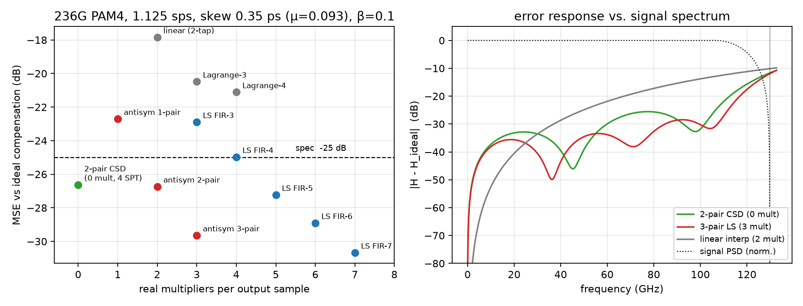
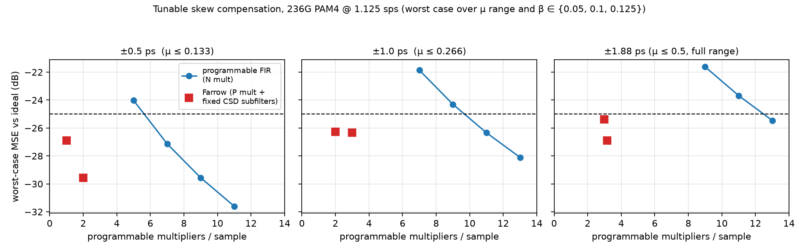
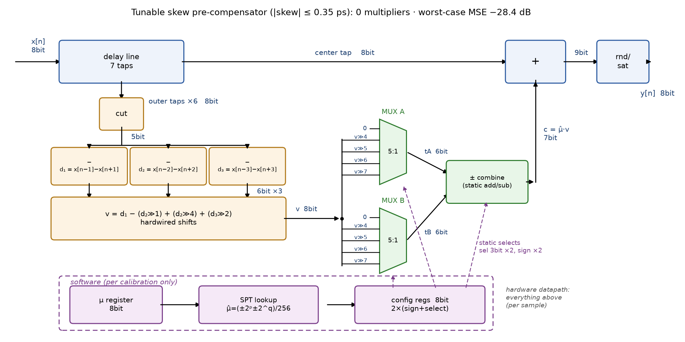

# 236 GBaud PAM4 Skew 预补偿：最低复杂度算法搜索（第 1 轮）

## 1. 问题定义

| 参数 | 值 |
|---|---|
| 波特率 | 236 GBaud，PAM4 |
| 采样率 | 236 × 1.125 = **265.5 GSa/s**（1.125 sps = 9/8） |
| 采样周期 Ts | 3.7665 ps |
| 待补偿 skew | 0.35 ps → **μ = 0.0929 个采样** |
| 约束 | 相对理想补偿（数百抽头 FIR / 频域相位斜坡）的 MSE < −25 dB |
| 目标 | 实现复杂度最低（以每输出样本的实数乘法器数为主要指标） |

**难点**：1.125 sps 过采样极低。RRC 滚降 β 在该采样率下最大只能取 0.125
（否则混叠），信号带边缘 (1+β)·118 GHz 达到 Nyquist（132.75 GHz）的
89%~100%。分数延时滤波器的误差集中在 Nyquist 附近，因此通用插值器
（linear / Lagrange / Farrow）在这里效率很低——它们优化的是全带平坦，
而我们只需要在信号 PSD 加权下达标。

**参考基准合法性**：401 抽头 Kaiser 加窗 sinc FIR 与频域理想延时的互差为
−118 dB，故仿真中以频域相位斜坡 e^{−j2πfτ} 作为"理想补偿"参考是严谨的。

## 2. 方法

- 信号：PAM4 随机符号 → 9 倍上采样 → RRC(β) 频域成形 → 8 倍抽取，得到
  1.125 sps 的发射信号（β ∈ {0.05, 0.10, 0.125} 全部覆盖）。
- 所有设计在一组信号上做最小二乘（LS）拟合（自动按信号 PSD 加权），
  在**独立的另一组信号**上验证 MSE，避免过拟合。
- MSE = mean|y − y_ideal|² / mean|y_ideal|²。

## 3. 候选算法对比（β = 0.10，独立验证集）

| 算法 | 乘法器/样本 | MSE (dB) | 达标 |
|---|---|---|---|
| 2 抽头线性插值 | 2 | −17.9 | ✗ |
| 3 抽头 Lagrange | 3 | −20.6 | ✗ |
| 4 抽头 Lagrange | 4 | −21.2 | ✗ |
| 7 抽头加窗 sinc | 7 | −24.5 | ✗ |
| 1 阶 Thiran 全通（IIR） | 1 | −13.9 | ✗（且 IIR 在 265.5 GSa/s 并行硬件中不可行） |
| 3 抽头 LS FIR | 3 | −22.9 | ✗ |
| 4 抽头 LS FIR | 4 | −25.0 | 临界 |
| **5 抽头 LS FIR** | 5 | −27.2 | ✓ |
| **反对称 2 对结构（下述）** | **2** | **−26.7** | ✓ |
| **反对称 2 对 + CSD 系数** | **0** | **−26.4 ~ −26.6** | ✓ |

结论明确：通用插值器全部不达标或代价过高；利用 μ 很小这一先验做
**结构化设计**后，复杂度断崖式下降。

## 4. 推荐方案（按复杂度从低到高分档）

### 方案 0（零成本）：并入已有 TX FIR

skew 固定已知（0.35 ps），预补偿传递函数 e^{−j2πfτ} 可直接乘进发射端
已有的成形/预加重 FIR 的频响里重新求抽头。**额外硬件代价为 0**，精度
等同于该 FIR 本身的长度（通常远优于 −25 dB）。若系统已有每通道 TX FIR，
这是唯一正确答案，其余方案仅在没有可复用 FIR 时才需要。

### 方案 1（推荐独立实现）：反对称 2 对结构，零乘法器

利用 μ = 0.093 ≪ 1：e^{−jωμ} = cos(ωμ) − j·sin(ωμ)，带内 cos(ωμ) ≈ 1
（带边缘处仅 0.96），误差几乎全部来自奇对称虚部。故将滤波器约束为
**单位中心抽头 + 反对称修正对**：

```
y[n] = x[n] + c1·( x[n−1] − x[n+1] ) + c2·( x[n−2] − x[n+2] )
```

- 先做两次预减法，再各乘一个系数 → 天然只需 **2 个乘法器**（5 抽头跨度）。
- LS 最优系数（β=0.1）：c1 = 0.0885，c2 = −0.0385 → MSE = **−26.7 dB**。
- 系数量化感知 CSD 搜索后取 **c1 = 3/32（= 1/16 + 1/32），c2 = −5/128
  （= −1/32 − 1/128）**，两个乘法各退化为 2 次移位相加，整条数据通路
  只有 **约 8 个加法器、0 个乘法器**：

| β | MSE (dB)，CSD 系数 |
|---|---|
| 0.05 | −27.1 |
| 0.10 | −26.6 |
| 0.125 | −26.3 |

  全部滚降取值下满足 −25 dB，余量 ≥ 1.3 dB。更省一档的
  c2 = −1/32（共 3 个 SPT 项、约 7 个加法器）仍有 −26.1 ~ −26.8 dB。

### 方案 2（需要更大余量时）：反对称 3 对结构

```
y[n] = x[n] + c1·(x[n−1]−x[n+1]) + c2·(x[n−2]−x[n+2]) + c3·(x[n−3]−x[n+3])
```

CSD 系数 (3/32, −5/128, 3/128)：MSE = **−29.5 dB**（β=0.1）/ −28.9 dB
（β=0.125），6 个 SPT 项，0 乘法器，约 11 个加法器。

## 5. 其他工程结论

- **量化位宽**：直接量化 LS 系数需 ≥6 bit 才达标（6 bit：−26.4 dB）；
  CSD 方案不存在该问题。
- **skew 变化的适应范围**：本结构按固定 0.35 ps 设计。若 skew 需要在线
  可调，同一结构中 c1、c2 随 μ 近似线性（c_k ≈ μ·d_k，d_k 为固定微分核），
  可做成"1 个可编程标量 μ × 固定微分滤波器"的一阶 Farrow，即
  y = x + μ·(d ∗ x)，增加 1 个乘法器即可覆盖 |skew| ≲ 0.5 ps；
  更大的 skew（>0.7 ps，μ>0.19）需要增加对数（见 sim 输出的鲁棒性表）。
- **IIR 不可取**：1 阶 Thiran 只有 −13.9 dB，且反馈环在 265.5 GSa/s
  需要 ~64–128 路并行化，递归结构无法流水，硬件上直接排除。
- **为何 −25 dB 是合理指标**：−26 dB 的补偿残差相对 PAM4 眼图约为
  最小眼幅的 ~1/20，远低于该速率下 DAC/驱动器本底。

## 6. 复现

```bash
pip install numpy scipy matplotlib
python3 sim_skew_precomp.py   # 通用候选算法扫描 + 量化 + 鲁棒性
python3 sim_structured.py     # 反对称结构化设计
python3 sim_csd.py            # 量化感知 CSD（零乘法器）搜索
python3 make_figures.py       # 生成 results.png
```



左图：MSE–乘法器数 Pareto（β=0.1，虚线为 −25 dB 指标）；右图：各方案
误差频响与信号 PSD 的对照——反对称结构把误差压制在信号占据的频带内，
仅在 PSD 已滚降的带边缘让误差抬升，这正是它以 0~2 个乘法器胜过
7 抽头通用设计的原因。

---
*第 1 轮结论：固定 0.35 ps 时，最低复杂度实现为「单位中心 + 反对称
2 对、CSD 系数(3/32, −5/128)」的 5 抽头结构：0 乘法器、约 8 加法器。*

# 第 2 轮：skew 在线可调（约束更新）

约束更新：① 不复用发射端成形 FIR，skew 补偿独立实现；② skew 需在线
可调。skew 是慢变的校准量（温漂/老化时间尺度），**不需要逐样本变**，
因此复杂度指标改为：**每输出样本的可编程乘法器数**。固定系数的子滤波器
仍可 CSD 移位相加化（≈0 乘法器），而系数可在线改写的乘法必须用真乘法器。

## 7. 结构：奇偶约束 Farrow（μ = 0 严格恒等）

把第 1 轮的反对称结构推广为 μ 的多项式：

```
y[n] = x[n] + μ·(C1 ∗ x)[n] + μ²·(C2 ∗ x)[n] + ... + μᴾ·(Cp ∗ x)[n]
```

- 奇数阶子滤波器反对称（预减法共享）、偶数阶对称（预加法共享），
  系数**固定**（设计一次，可 CSD 化）；
- μ, μ², …, μᴾ 由固件在校准更新时算好写入寄存器；
- 每样本硬件代价 = **P 个可编程标量乘法器** + 固定子滤波器的加法器；
- 整数样本部分用移位寄存器 + mux 选择（无乘法器），故分数部分只需
  覆盖 μ ∈ [−1/2, +1/2]（±1.88 ps），即可配合整数延时线覆盖任意 skew。

设计：在 β = 0.125（最宽 PSD，最坏情形）信号上对 μ 网格做联合加权 LS；
在独立信号上验证，报告 **μ 全范围 × β ∈ {0.05, 0.1, 0.125} 的最坏 MSE**。

## 8. 结果：按可调范围分档

| 校准范围 | 最低结构 | 可编程乘法器 | 最坏 MSE | 备注 |
|---|---|---|---|---|
| ±0.5 ps（μ≤0.133） | P=1, K=4 对（9 抽头跨度） | **1** | **−26.9 dB** | y = x + μ·(D∗x)，一阶即可 |
| ±1.0 ps（μ≤0.266） | P=2, K=5 对 | **2** | **−26.3 dB** | 加对称二阶项 |
| ±1.88 ps（μ≤0.5，全范围） | P=3, K=6 对（13 抽头跨度） | **3** | **−25.4 dB** | 配合整数延时线覆盖任意 skew |
| 同上（余量版） | P=3, K=7 | 3 | −26.9 dB | 多 1 对固定系数（只加加法器） |

对照基线（可编程系数 N 抽头 FIR，固件按 μ 重算抽头）：同样精度下
±0.5 ps 需 7 抽头（7 乘法器）、全范围需 13 抽头（13 乘法器）。
**Farrow 把可编程乘法器从 7~13 个压到 1~3 个**，代价只是固定系数
子滤波器的加法器（CSD 后每对约 2~3 个加法器）。



### 推荐设计的系数与量化

**±0.5 ps 档（1 乘法器，推荐起点）**：

```
y[n] = x[n] + μ · Σₖ c₁ₖ·(x[n−k] − x[n+k]),  k = 1..4
C1 = [0.9662, −0.4412, 0.2563, −0.1575]
```

- 子滤波器 5 bit 量化仍 −26.8 dB（CSD 化后每系数 ≈2 个 SPT 项）；
- μ 寄存器 8 bit（1/256 样本 ≈ 15 fs 步进）无可见劣化；
- 该设计名义 0.35 ps 处 MSE 远优于最坏值（最坏出现在范围端点）；
- 拉伸测试：同结构设计到 ±0.6 ps 时最坏 −24.6 dB（临界），
  故 1 乘法器档的适用边界约为 **±0.55 ps**。

**全范围档（3 乘法器）**：P=3、K=6，Horner 形式
`y = x + μ·(v1 + μ·(v2 + μ·v3))`，v1/v3 反对称、v2 对称，8 bit 子滤波器
系数下 −25.3 dB（K=7 时 −26.8 dB，建议取 K=7 留余量）。

## 9. 第 2 轮工程结论

1. **skew 只在 ±0.5 ps 内校准** → 一阶结构：**1 个可编程乘法器 +
   约 10 个加法器**，−26.9 dB。这是本命题下可调方案的复杂度下限
   （任何可调结构至少要 1 个乘法器）。
2. **需要覆盖任意 skew** → 整数延时线（mux）+ 三阶 Farrow（K=7）：
   **3 个可编程乘法器 + 约 35 个加法器**，全范围 −26.9 dB。
3. 校准接口极简：固件只需写 {整数延时, μ, μ², μ³}，切换无毛刺
   （系数固定，只有标量在变）。
4. 可编程 FIR 方案（7~13 个乘法器）在任何档位都被 Farrow 支配，
   仅当芯片里已有现成可复用的可编程 FIR 时才值得考虑。

复现：`python3 sim_farrow.py`（扫描 P、K、范围 + 基线对照 + 量化）。

---
*第 2 轮结论：可调 skew 补偿用奇偶约束 Farrow。±0.5 ps 内 1 个可编程
乘法器；全范围（±1.88 ps，配合整数延时线）3 个可编程乘法器，全部满足
最坏情形 MSE < −25 dB。*

# 第 3 轮：最终冻结设计（|skew| ≤ 0.35 ps，在线可调）

约束最终确定：最大 skew 只需考虑 0.35 ps（μ ∈ [−0.093, +0.093]），
在线可调。μ 很小 ⇒ 一阶结构（P = 1）即可，且 K 可进一步压缩，
子滤波器 CSD 搜索后系数恰好落在极简值上：

```
d1[n] = x[n−1] − x[n+1]
d2[n] = x[n−2] − x[n+2]
d3[n] = x[n−3] − x[n+3]          （仅方案 B）

方案 A（最简）：  y[n] = x[n] + μ·( d1[n] − (7/16)·d2[n] )
方案 B（推荐）：  y[n] = x[n] + μ·( d1[n] − (7/16)·d2[n] + (1/4)·d3[n] )
```

7/16 = 1/2 − 1/16（2 次移位相加），1/4 为纯移位。系数为硬件常数，
**在线只改 μ**（有符号 6 bit 即够，步进 ≈ 59 fs）。

**每输出样本的硬件代价与性能**（独立信号、密集 μ 网格 × 全部 β 的最坏值）：

| 方案 | 可编程乘法器 | 加法器 | 最坏 MSE | 余量 |
|---|---|---|---|---|
| A：2 对 | **1** | 5 | **−26.3 dB** | 1.3 dB |
| B：3 对 | **1** | 7 | **−28.9 dB** | 3.9 dB |
| B + 6 bit μ 寄存器 | 1 | 7 | −28.7 dB | 3.7 dB |

最坏点出现在 μ 端点（即名义 0.35 ps 处）；β 取到该采样率的上限
0.125 时仍达标。μ 由固件按校准结果写入，符号覆盖 ±skew 两个方向。

**结论（最终）**：|skew| ≤ 0.35 ps 的在线可调预补偿，最低复杂度实现为
**1 个小位宽（6 bit 系数）可编程乘法器 + 7 个加法器**（方案 B，7 抽头
跨度，3 个采样的固定群时延），最坏 MSE = −28.9 dB。若面积极度受限，
方案 A 以 5 个加法器达 −26.3 dB。1 个乘法器是任何在线可调结构的下限，
因此该方案在乘法器维度上已不可再降。

复现：`python3 sim_final.py`（系数硬编码，独立数据验证）。

# 第 4 轮：仅从功耗角度的进一步优化

动态功耗 ∝ 翻转活动 × 有效位宽，与面积的权衡不同。μ 准静态（只在校准
时更新）这一点在功耗维度可以榨得更彻底。三个定量结论（`sim_power.py`）：

## 10. 修正通路可以大幅截位（Q1）

修正项经 μ ≤ 0.093 缩放后才进主通路，其量化噪声被压低 ~21 dB，
因此 d_k 和乘积的位宽可远低于主通路：

| d_k 位宽 | 乘积位宽 | 最坏 MSE |
|---|---|---|
| 全精度 | 全精度 | −28.9 dB |
| 5 bit | 8 bit | −28.4 dB |
| 4 bit | 7 bit | −27.1 dB |
| 4 bit | 6 bit | −26.1 dB |

即：修正通路整体跑在 4~5 bit 就够。差分 d_k 可先取 x 的高 5~6 位再相减，
减法器本身也是窄位宽的。

## 11. 乘法器可整体消除：μ 折进抽头 + 可编程静态移位（Q2）

把 μ 折进各抽头得到等效系数 t1 = μ、t2 = −(7/16)μ、t3 = μ/4，
它们同样准静态。校准时由固件把每个 t_k 分解为 **≤2 个带符号 2 的幂
（SPT）项**写入配置寄存器，数据通路变成纯「桶形移位 + 加法」：

```
y[n] = x[n] + Σₖ (±2^(−aₖ) ± 2^(−bₖ)) · d_k[n]
```

- ≤2 SPT/抽头：最坏 **−28.8 dB**（8 bit μ 寄存器，全 μ、全 β）；
  1 SPT/抽头不够（−23.7 dB）；
- 与 5 bit d_k 截位叠加：**−28.4 dB**，余量仍有 3.4 dB；
- 移位器的选择线静态不翻转（mux 功耗 ≈ 走线），无乘法器部分积
  翻转、无 Booth 编码逻辑；每样本动态能量只剩 3 个窄减法 +
  ~5 个窄加法 + 1 个全宽输出加法。

粗略能量估算（按「加法器位宽单位」）：第 3 轮乘法器版 ≈ 90 单位/样本，
本版 ≈ 55~65 单位/样本，**约省 30~40% 动态功耗**，精度反而略优
（−28.4 vs −28.7 dB）。代价是面积略增（6 个可编程移位网络）和
固件多一步 SPT 分解（查表即可）。

## 12. 功耗的真正下限：把 0.35 ps 移到时钟域（Q3）

纯延时残差 δ 对应的 MSE（最坏 β）：

| 残差 δ | MSE |
|---|---|
| 0.05 ps | −33.3 dB |
| 0.10 ps | −27.3 dB |
| 0.15 ps | −23.8 dB |

即残差 ≤ 0.12 ps 就满足 −25 dB。若 DAC 采样时钟路径上有每通道相位
插值器（PI）/可编程延时线——**LSB ≤ 0.2 ps（四舍五入后残差 ≤ 0.1 ps）
即可，这在现代 SerDes/DAC 时钟 PI 中是宽松指标**——则 0.35 ps 的 skew
可完全在时钟域补偿：**每样本数字功耗严格为零**，只有一个静态 PI 码。
约束条件：PI 引入的附加抖动需 ≪ 0.1 ps RMS（占残差预算），且需要
每通道独立的时钟微调能力。

## 13. 第 4 轮结论（按功耗排序）

1. **DAC 时钟域补偿**（若硬件支持每通道 ~0.2 ps 步进的时钟微调）：
   每样本数字功耗为零，精度要求宽松，首选。
2. **全移位数字结构**（§11 + §10）：0 乘法器、修正通路 5 bit、
   静态选择线，−28.4 dB，较第 3 轮设计省约 30~40% 动态功耗，
   数字方案中的功耗最优。
3. 第 3 轮设计 B + 修正通路截位（d=5b/p=8b）：若不想加可编程移位网络，
   仅靠截位也能白拿一部分功耗收益，−28.4 dB。

复现：`python3 sim_power.py`。

## 14. 第 4b 轮：mux 到底要几选一（结构再精简）

§11 把 μ 折进 3 个抽头需要 6 个可编程移位器。更优的因式分解是保持
第 3 轮的结构不动，只把「μ × v」这一级换成 2 项 SPT：

```
v[n] = d1 − (7/16)·d2 + (1/4)·d3      ← 7/16、1/4 硬连线移位，无 mux
y[n] = x[n] + (±2^(−a) ± 2^(−b))·v[n] ← 仅 2 个可编程移位器作用在 v 上
```

共享同一个 μ̂ 使三个抽头的比例严格保持，精度与浮点 μ 设计一致。

**移位挡位的推导**：μ 寄存器 8 bit（步进 2⁻⁸），|μ| ≤ 24/256，
故 μ̂ = (±2ᵖ ± 2^q)/256。仿真验证挡位窗口（全部 μ 码 × 全部 β 最坏值）：

| 移位挡位 | mux 规格 | 最坏 MSE |
|---|---|---|
| {2⁻²…2⁻¹²}（不限） | — | −28.66 dB |
| {2⁻⁴…2⁻⁸} | 6 选 1 | −28.66 dB |
| **{2⁻⁴…2⁻⁷}** | **5 选 1** | **−28.66 dB** |
| {2⁻⁴…2⁻⁷} + d_k 截 5 bit | 5 选 1 | −28.28 dB |
| {2⁻⁵…2⁻⁸}（缺 2⁻⁴） | 6 选 1 | −24.70 dB ✗ |

**结论：每个可编程移位器 = 4 个移位挡位 + 1 个置零挡 = 5 选 1 mux
（每数据位一个，3 bit 静态选择线）**；符号用加/减控制（静态 XOR +
进位），不占 mux。2⁻⁴ 挡不可省（μ 最大码 24/256 的首项是 16/256）；
更深的挡位（2⁻⁸ 以下）不需要——μ 小时补偿量本身小，奇数码 ±1/256 的
舍入误差折算到输出仅 −40 dB 量级。

最终每样本数据通路：3 个窄减法（5~6 bit）+ 2 个硬连线移位加（v）+
2 个 5:1 静态 mux + 1 个合并加法 + 1 个全宽输出加法。固件每次校准：
把 μ 码分解为 (±2ᵖ ± 2^q)/256（p,q ∈ {0..4}，查 49 项表），写入
2 × (符号 1 bit + 选择 3 bit) = 8 bit 配置。复现：`python3 sim_mux.py`。

## 15. 方案框图与逐节点位宽（第 4c 轮）

主通路假设 s8（8 bit 有符号补码，LSB = FS/128，FS 为 x 满幅）。
整条定点链逐节点仿真验证（`sim_fixedpoint.py`）：
**最坏 MSE = −28.35 dB**（β=0.125, μ=−0.086），余量 3.3 dB。



```
x[n] ──► 延时线 7×s8 ─────────────────────────center s8──────────► (+) ─► rnd/sat ─► y[n] s8
              │外侧6抽头 6×s8                                       ▲     (s9→s8)
              ▼ 丢 3 个 LSB → s5 (LSB=FS/16)                        │
   ┌──────────┼──────────┐                                          │
   ▼          ▼          ▼                                          │
 (−)d1      (−)d2      (−)d3        每个 s6, LSB=FS/16              │
   └────┬─────┴──────────┘                                          │
        ▼ 硬连线移位加（无 mux）                                     │
   v = d1 − (d2>>1) + (d2>>4) + (d3>>2)     v: s8, LSB=FS/32        │
        ├─► 5:1 mux 移位器 A {off,>>4..>>7} ─► tA: s6, LSB=FS/128 ┐ │
        └─► 5:1 mux 移位器 B {off,>>4..>>7} ─► tB: s6, LSB=FS/128 ┴►(±合并)─► c: s7 ──┘
                    ▲静态选择线（3bit×2 + 符号1bit×2，双缓冲）
 μ寄存器 s8 ─► 固件 SPT 查表(49项) ─► 配置寄存器 8bit
```

| 节点 | 格式 | LSB 权重 | 范围 | 说明 |
|---|---|---|---|---|
| x[n] 输入/延时线 | s8 ×7 | FS/128 | ±FS | 主通路 |
| 截位后 x_t | s5 ×6 | FS/16 | ±FS | 丢 3 个 LSB，仅修正通路 |
| d1, d2, d3 | s6 | FS/16 | ±2FS | 3 个窄减法器 |
| 7/16·d2、1/4·d3 | 舍入到 | FS/32 | — | 硬连线移位，无 mux |
| v | s8 | FS/32 | ±3.375FS | 2 个移位加 |
| tA, tB | s6 | FS/128 | ±0.21FS | 5:1 mux 输出，舍入对齐主通路 |
| c = μ̂·v | s7 | FS/128 | ±0.32FS | 静态加/减合并 |
| x + c | s9 | FS/128 | — | 输出加法器 |
| y[n] 输出 | s8 | FS/128 | ±FS | 舍入 + 饱和 |
| μ 寄存器 | s8 | 1/256 | \|码\| ≤ 24 | 固件写 |
| 配置寄存器 | 8 bit | — | — | 2×(符号1b+选择3b)，双缓冲 |

若主通路实际为 s9/s10：所有 LSB 权重同步下移，修正通路的**相对**截位
量不变（x_t 仍取最高 5 位、c 对齐主通路 LSB 即可），结论不变。
复现：`python3 sim_fixedpoint.py`、`python3 make_blockdiagram.py`。

## 附：为何不用多路 mux 选固定 CSD 滤波器（零乘法器）替代

残余延时误差 δ 的 MSE ≈ δ²·⟨ω²⟩ ≈ −25 dB 要求 δ ≲ 0.12 ps，即 μ 步进
≈ 0.06 样本 → 覆盖 ±0.093 需 4~8 个硬连线分支 + mux。共享 d1/d2 后每
分支仍需 ~4 个加法器，总代价（~30+ 加法器 + 宽 mux）高于 1 个 6 bit
乘法器（Booth 编码后 ≈3~4 个加法器等效）。故乘法器方案面积更优，
且 μ 分辨率不受分支数限制。*
